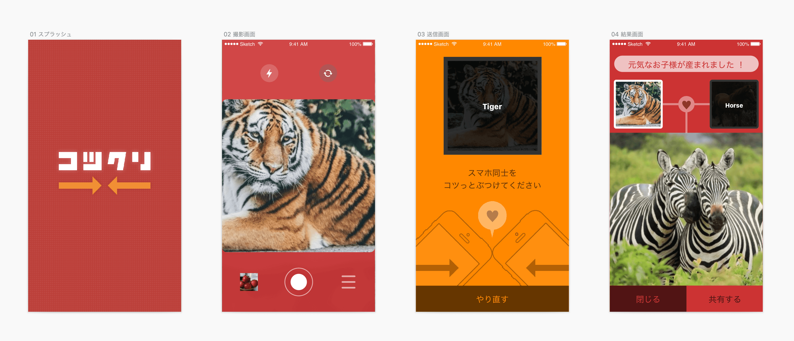

For example, from images of a "chair" and "desk," the app returns an image of a "room." Microsoft Computer Vision API recognizes input images and applies labels. From those labels, word2vec generates conceptually child words, and Microsoft Bing Search API returns images based on those words.

I participated with a friend, handling ideation and all overall design work including app design and presentation materials. I used Sketch and Sympli to efficiently coordinate work with engineers.