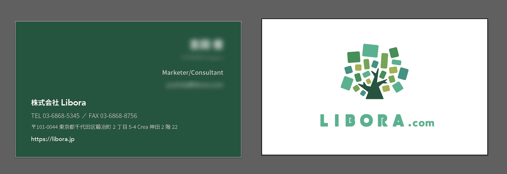

)

Upon the establishment of Libora Inc., I was invited as a designer. I was involved in company logo, business cards and branding direction, as well as corporate website coding and service UI design support.

The corporate website was implemented with a modern frontend configuration called JAMStack, and I created a website that can be easily updated with a CMS called Contentful.