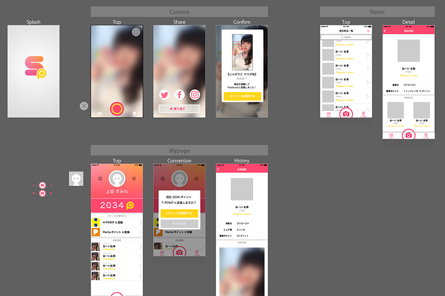

An app where the concept is selfies of products + point rewards. Companies can pay advertising fees for the high advertising effect of "selfies from acquaintances."

## Promotional Video

    <iframe width="560" height="315" src="https://www.youtube.com/embed/uisASoDBFqg" frameborder="0" allow="accelerometer; autoplay; clipboard-write; encrypted-media; gyroscope; picture-in-picture" allowfullscreen></iframe>

## Poster

