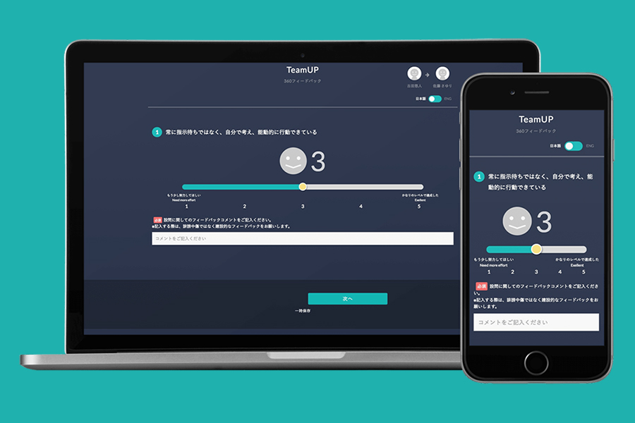
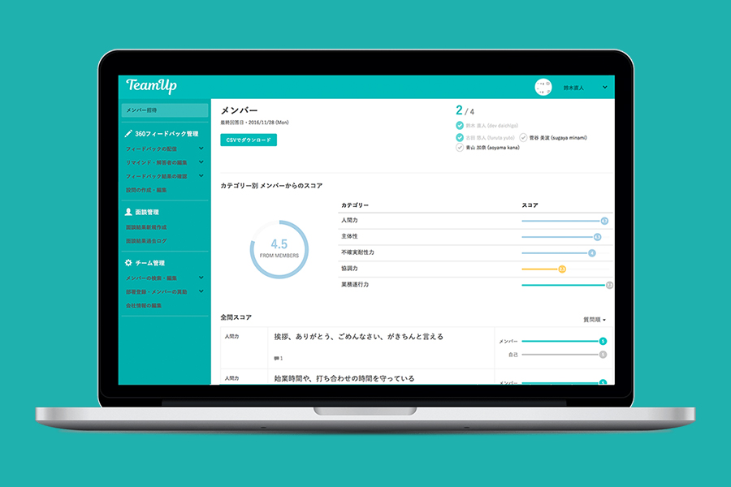

A B2B web service by [TeamUp Inc.](https://www.teamup.jp/corporate). I was involved from the planning phase, participating as an initial team member in a team of about 5 people. Since I was a university student at the time, my participation was as an intern, but as lead designer, I was responsible for overall design, logo design, coding, and frontend interactions. The design prioritized the list view and visibility that HR managers need.

