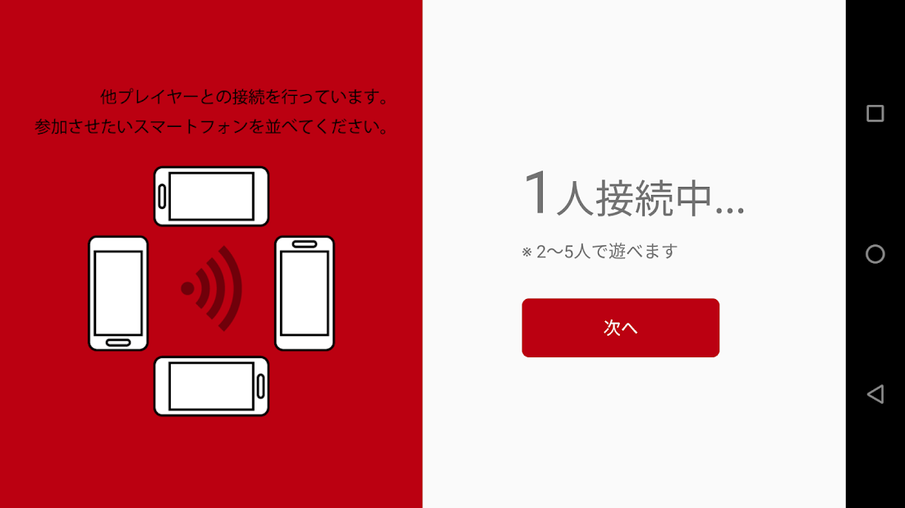

A card game app created at a hackathon. You can play it with a realistic feeling of holding cards by tilting your smartphone. Created in one day with 4 people, and I handled overall design.

## Implementation
Since learning was a strong goal, I challenged myself to Android UI implementation for the first time. I created the layout using XML. The source code is published on [GitHub](https://github.com/akirago/togemp).

## UI

