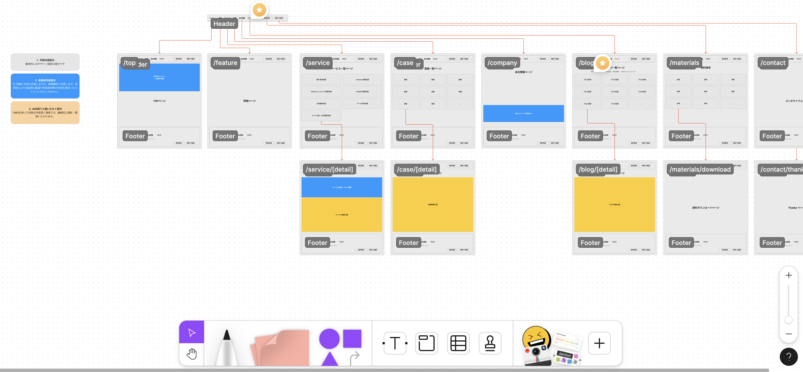
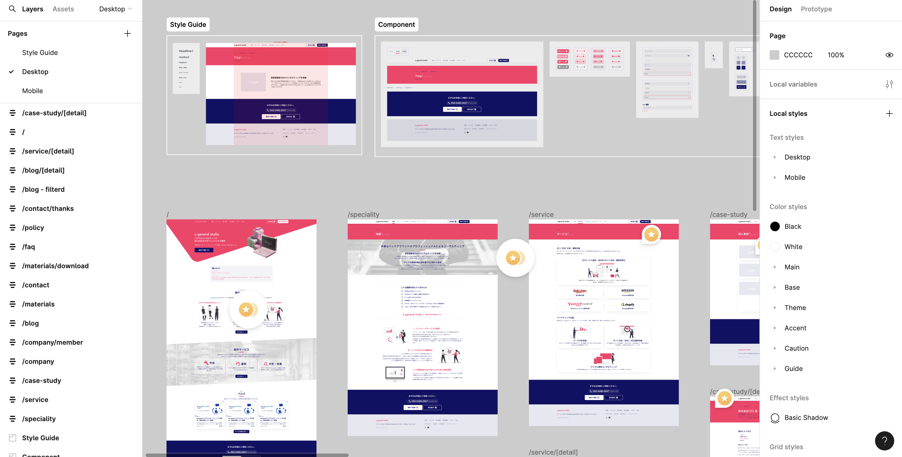

我负责与业务扩展相伴随的企业网站重新设计。*显示的图像来自开发阶段。

## 品牌塑造

最初只有一个标志可用，我创建了情绪板来定义公司的特征和目标基调。

## 线框图

With many pages and overlapping information, I conducted interviews about navigation design and user priorities, then restructured the layout.

## 设计

使用Figma创建

由于编码由另一个团队负责，我将其创建为『Figma文件作为文档』以使材料和响应式设计清晰易懂。
