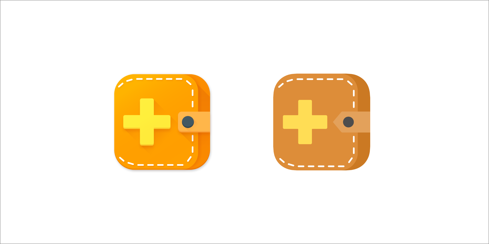
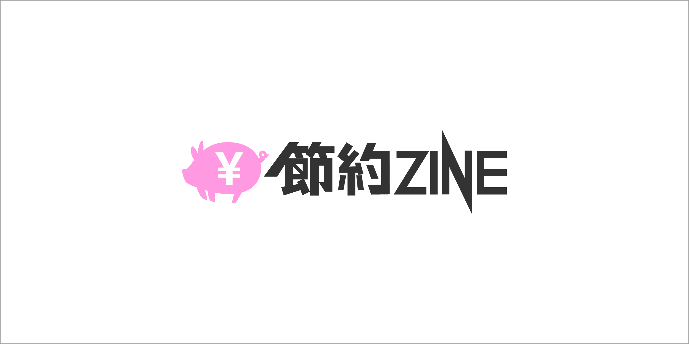
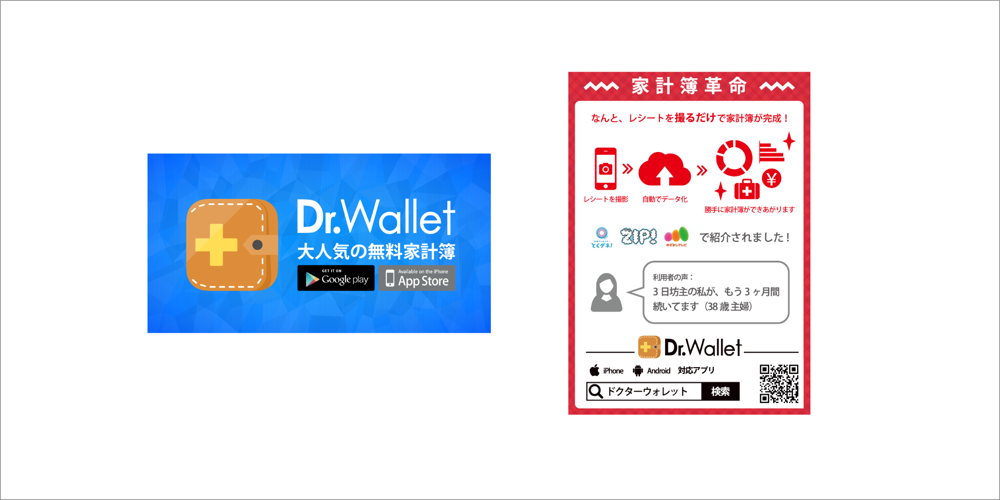

我在TOKIUM公司担任设计师，协助进行广泛的项目，包括标志设计、网络横幅、印刷材料、UI和演示文稿。由于当时是一个小团队，我参与了各种项目并充当通用工作人员。

## Dr.Wallet标志设计
以扁平设计和材料设计风格创建，标志简洁地表达了应用程序的概念。

## Savings ZINE标志设计
我负责[Savings ZINE](https://www.drwallet.jp/navi/)（现为：Dr.Wallet Navi）的象形图和排版标志。

## 网络横幅、传单等
由于产品的性质，进行了许多宣传活动，导致创建了数十个横幅和传单。

