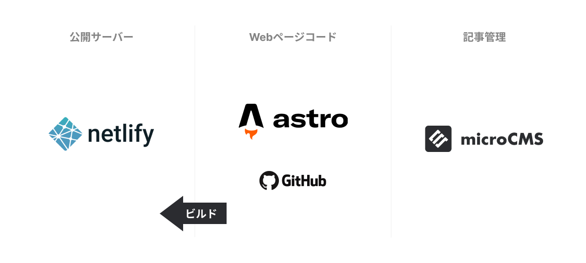

## 概览
我承担了之前使用无代码工具创建的博客媒体网站的更新。由于无代码工具限制了自定义和营销灵活性，我建议在自由可修改的环境中从头开始创建网页。

## 系统架构

在我的项目中，我通常避免使用WordPress，而是建议采用Headless CMS配置，在维护、操作和安全性方面更优越。

对于文章创建和管理，我使用[microCMS](https://microcms.io/)，这对非工程师来说很容易使用。前端使用[Astro](https://astro.build/)构建，这是一个能够创建极其快速网页的静态网站构建器。

对于主机，我使用[Netlify](https://www.netlify.com/)，它自动响应文章更新而重新构建网站。
