这是内容创作，人们享受我准备的菜肴，我们一起烹饪，我通过食物与他人联系。我的烹饪照片曾在[筑波公寓信息网站Tsukuie](https://tsukuba-daigaku.com/?m=201308&paged=19)上展出。由于这也帮助我学习美食摄影和照片修饰，我强烈推荐这个爱好给设计师。我定期在[Instagram](https://www.instagram.com/psephopaiktes/)上更新，请查看！

## 喜爱的照片

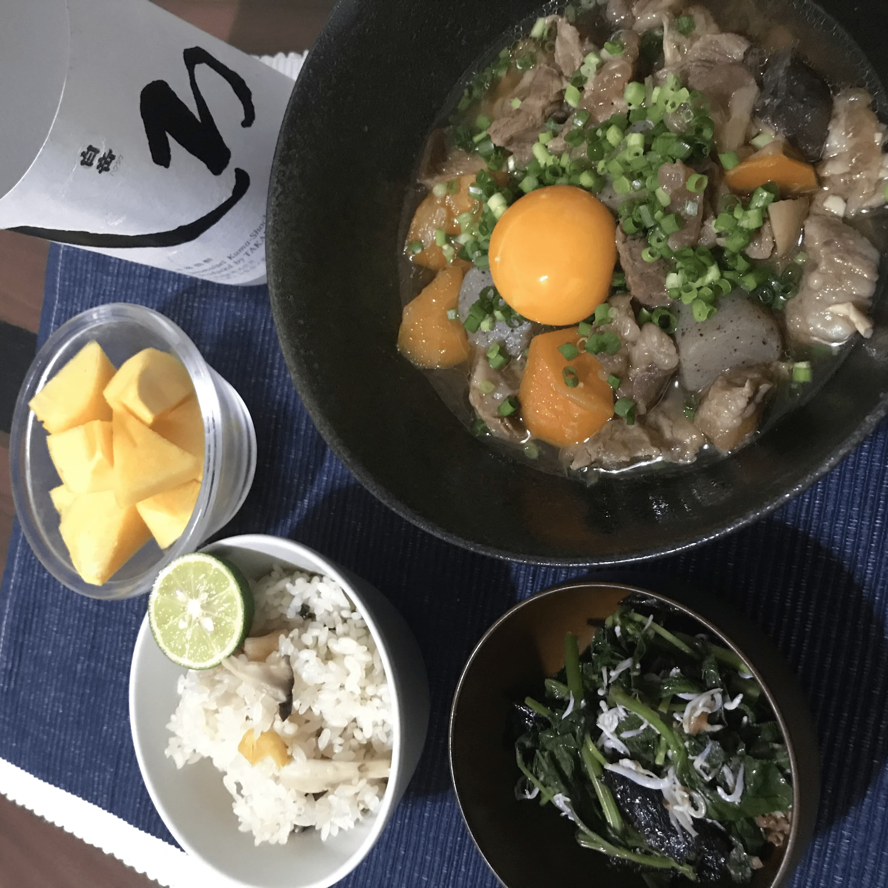

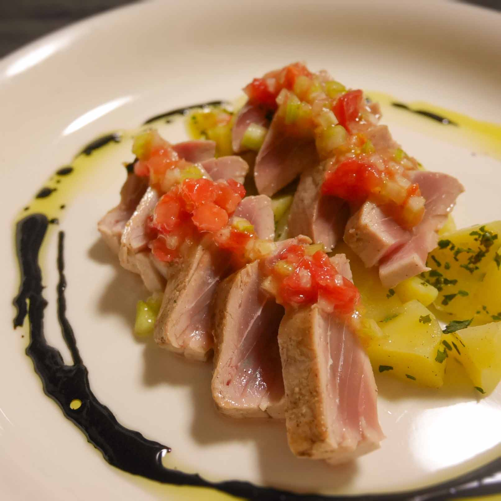

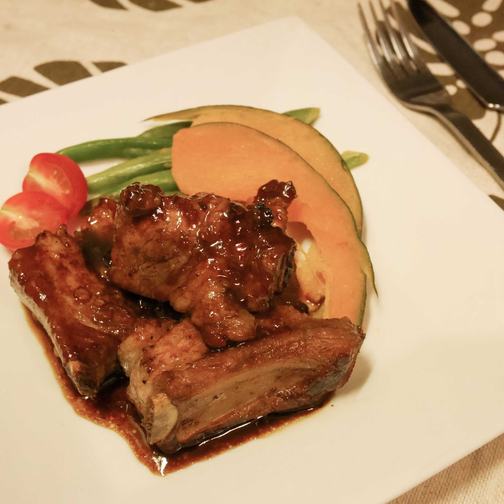

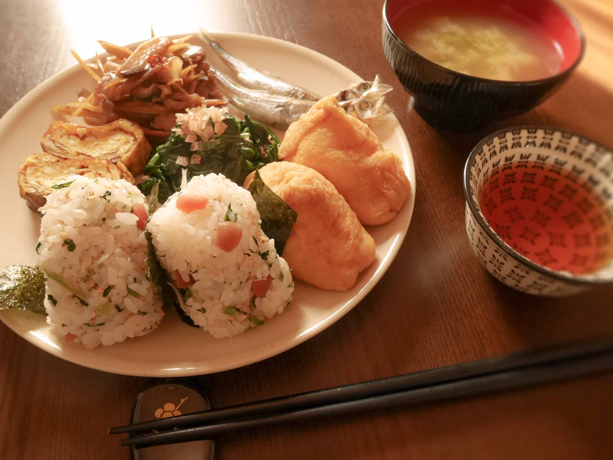

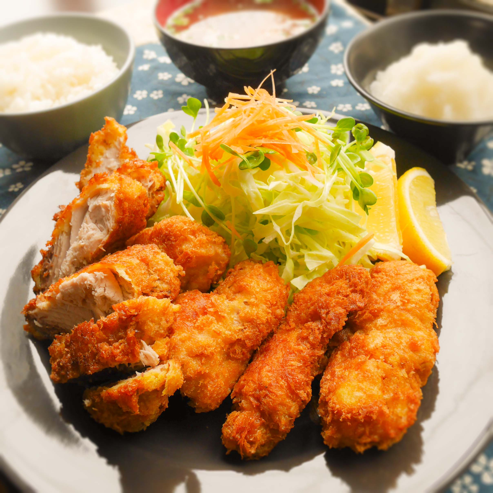

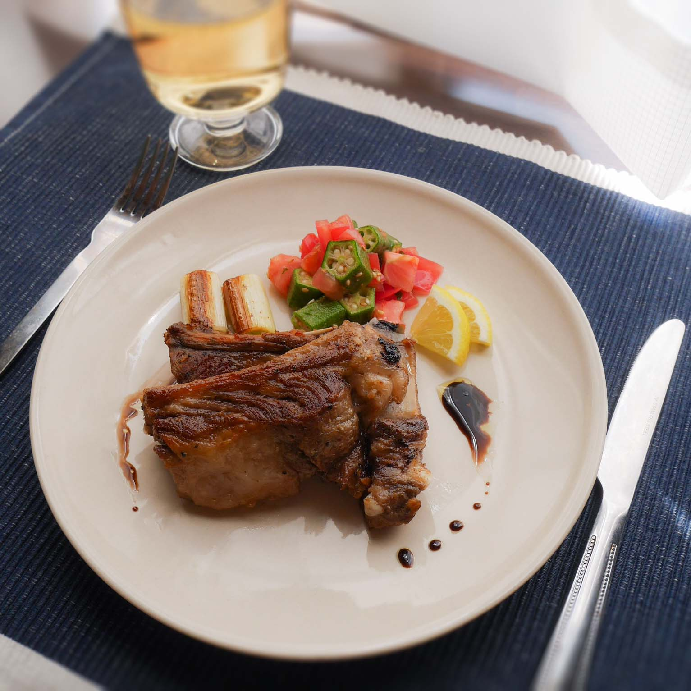

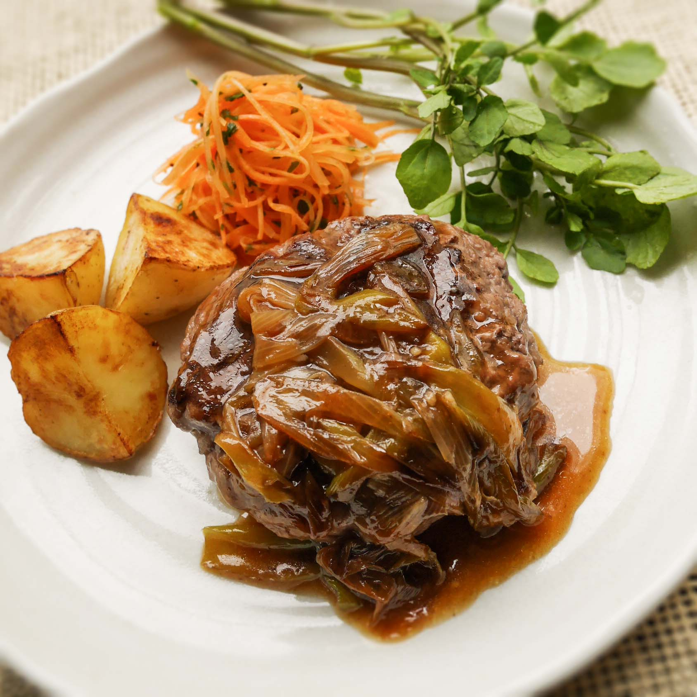

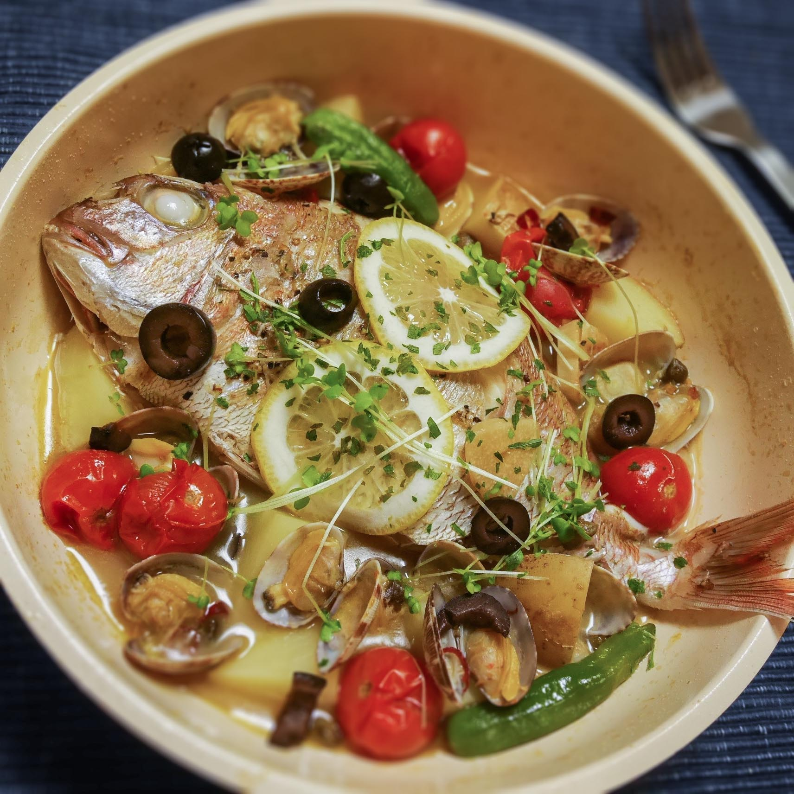

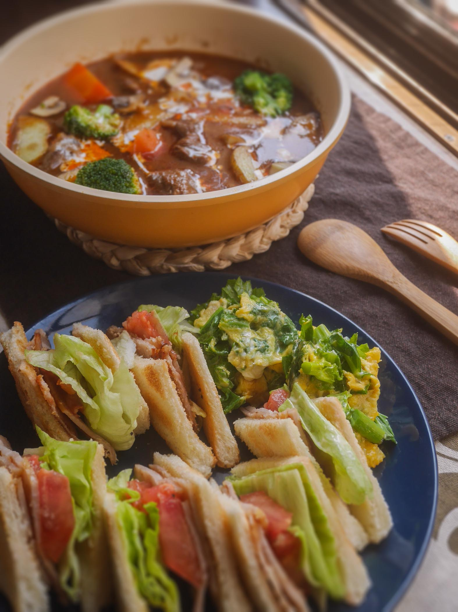

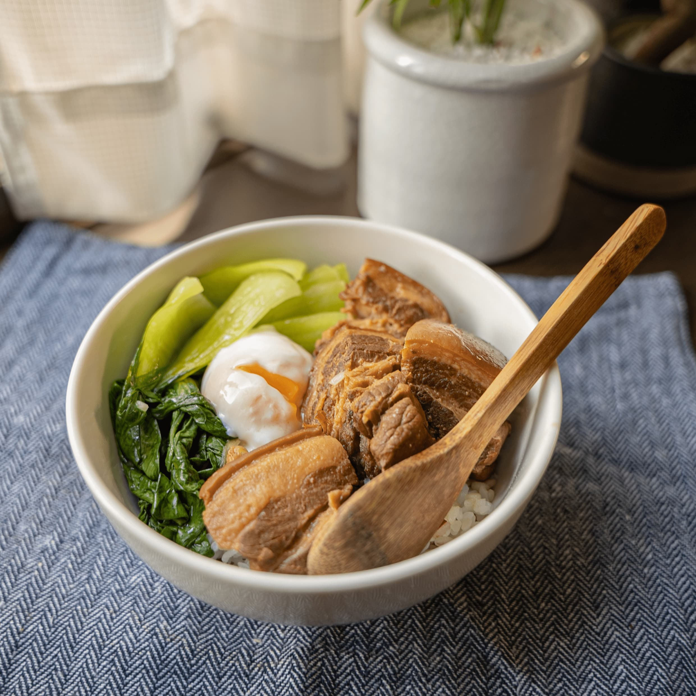

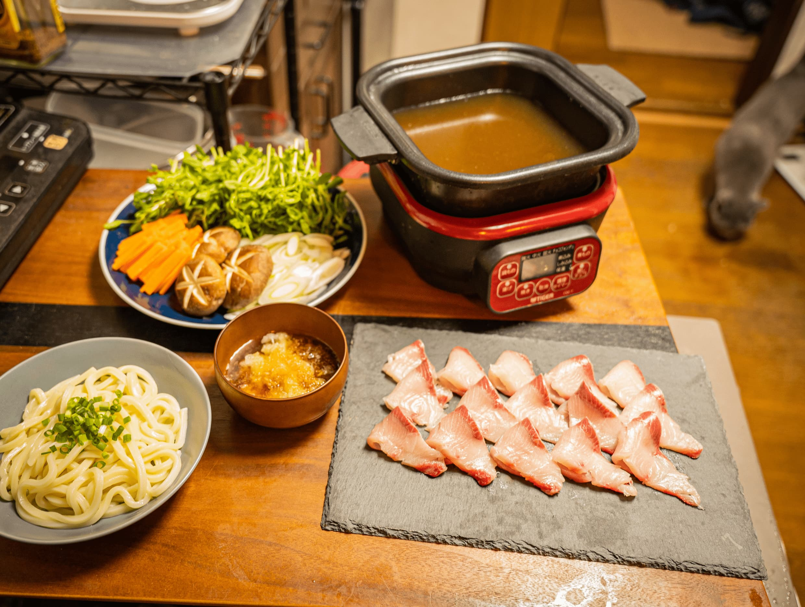
