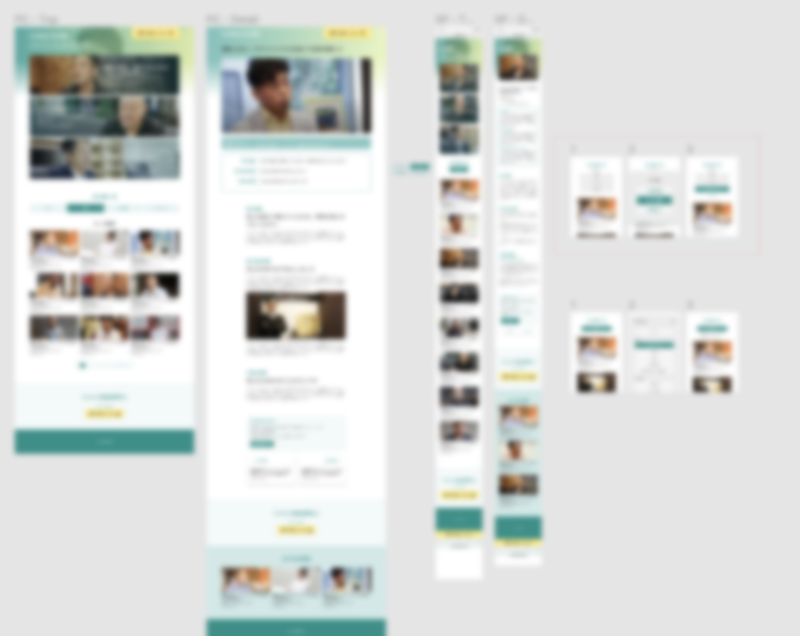

我为[CraftBank Inc.]()'s own service [CraftBank](https://craft-bank.com/)创建了案例研究页面。我进行了关于页面需求和设计概念的访谈，创建了线框图，并提供了指导。我还处理了网站设计、WordPress的CMS构建和网页编码。

<small>*目前未发布，所以图像被模糊了。</small>

我自定义了WordPress发布页面以允许上传专门的元信息（如公司规模和用例），并实现了案例过滤功能。
