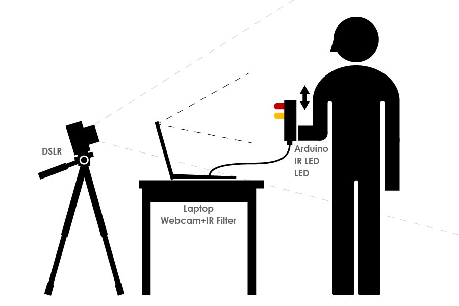

作为筑波大学研究生院Yoichi Ochiai班级的3人团队项目创建。

## 机制
概念是『使用人力数字创建艺术』。系统由Arduino、IR LED、数码单反相机、PC和IR滤光片组成。软件使用Processing开发。当挥动设备时，当设备进入预设图像区域时光线照亮，通过慢快门摄影创建艺术作品。

## 示例
通过加载透明的PNG，任何图像都可以转换为光艺术。

## 我的责任
* 规划和构思
* 使用Processing创建系统
* 部分论文撰写
