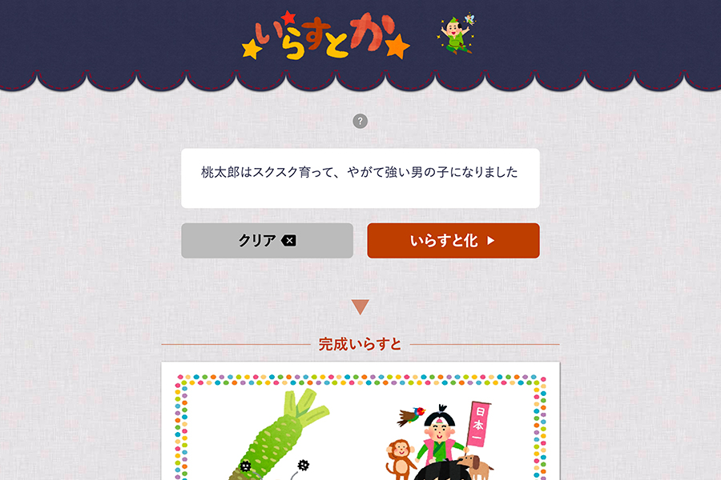

一个将输入文本转换为插图的网络应用程序。该应用程序对文本字符串执行形态分析，与维基百科关键词链接，并呈现适当的单个图像。

在包括[GIGAZINE](https://gigazine.net/news/20170206-irasutoya-irasutoka/)、[livedoor NEWS](https://news.livedoor.com/article/detail/12638328/)、[APPBANK](https://www.appbank.net/2017/02/06/iphone-news/1308841.php)、[BuzzFeed](https://www.buzzfeed.com/akikochino/irasutoka?utm_term=.qsVLx58j8#.hqond64G4)、[ねとらぼ](https://nlab.itmedia.co.jp/nl/articles/1702/07/news092.html)和[Yajiumawatch](https://internet.watch.impress.co.jp/docs/yajiuma/1042606.html)等多个媒体中有特色。

我参加了一个5人团队，负责规划、设计和前端。我旨在创建『有趣』的服务，并设计了可让用户立即使用而不会感到困惑的版面。

