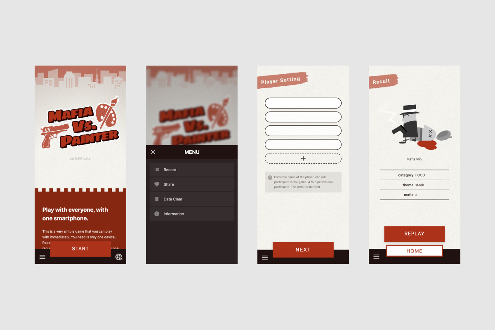

## 概览
一个如果您有纸、笔和4个或更多玩家，可以在智能手机上单独玩的绘画棋盘游戏。基于棋盘游戏[A Fake Artist Goes to New York](https://oinkgames.com/games/a-fake-artist-goes-to-new-york/)的规则，我的目标是创建一个简单的游戏，其中每个人都可以轻松一起享受。支持日文和英文。

我处理了规划、设计、架构和实施。

## UI
根据最近设备的扩展，我采用了底部导航，这样您就不必将手指伸向显示屏的顶部。当然，它是响应式的。

## 实施
作为PWA发布，允许网页作为应用程序提供。主要使用Vue.js创建。源代码发布在[GitHub](https://github.com/psephopaiktes/mafia-vs-painter)上。
