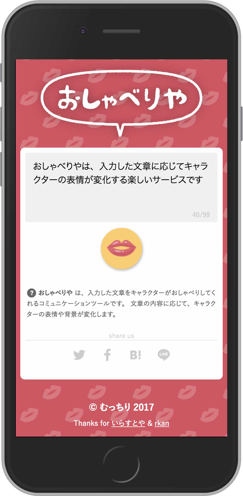

输入文本使用自然语言处理进行分析以估计情感，角色的面部表情随之改变。我参加了一个5人团队，负责设计和前端。我实现了过渡设计和交互，让用户在不感到困惑的情况下享受体验。

<iframe class="youtube" width="560" height="315" src="https://www.youtube.com/embed/7zQQ56bYVnE" frameborder="0" allow="accelerometer; autoplay; clipboard-write; encrypted-media; gyroscope; picture-in-picture" allowfullscreen></iframe>
