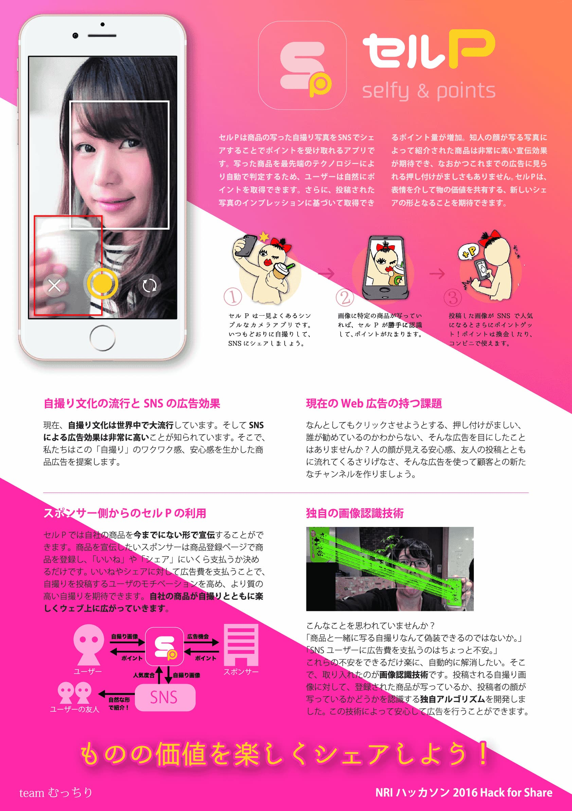

一个应用程序，其中产品自拍概念+积分奖励。公司可以为『熟人自拍』的高广告效果支付广告费。

## 宣传视频

    <iframe width="560" height="315" src="https://www.youtube.com/embed/uisASoDBFqg" frameborder="0" allow="accelerometer; autoplay; clipboard-write; encrypted-media; gyroscope; picture-in-picture" allowfullscreen></iframe>

## 海报

